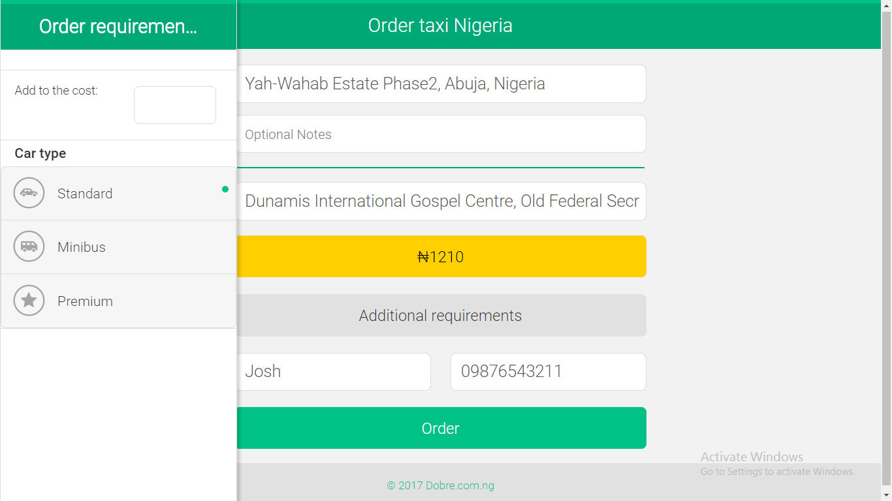
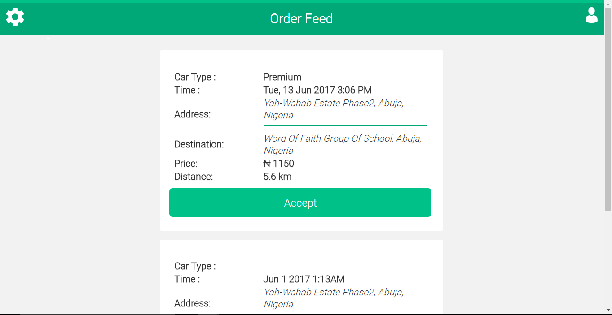
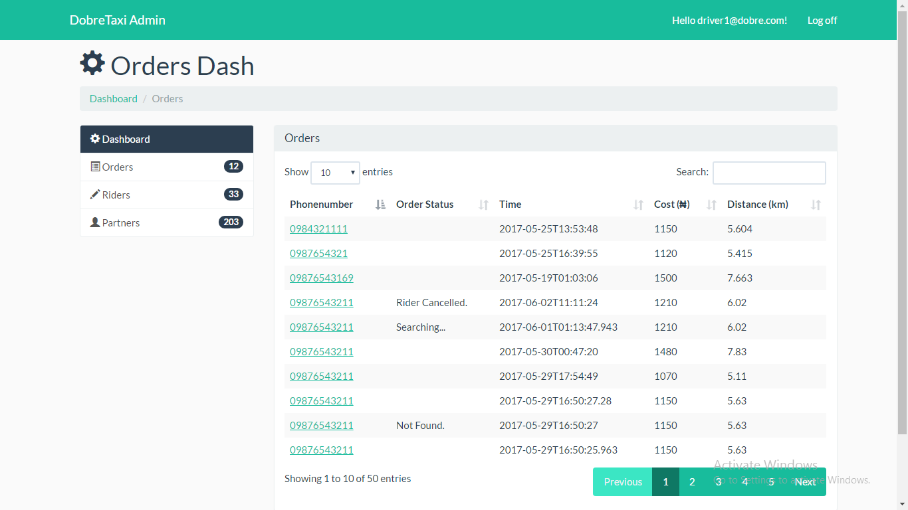

# DobreTaxi
A web app similar to Uber/Taxify. It provides users the ability to make request for rides. It comprises of three different application; one for the rider to request a ride, another for the driver to view requests and accept orders, and finally an application for the admin to carry out administrative duties. 

# Technologies 

**Back-end**
- C#, Asp.net MVC, Asp.net Web API 

**Front-end**
- HTML, CSS, Javascript, AngularJS, Jquery mobile.

**Screenshot**

- Main page for riders to place orders

- Drivers homepage.
Shows list of available orders placed by riders to drivers. 

- Admin Backoffice
Provides website administrators with the ability to perform administrative duties for both riders and drivers.

